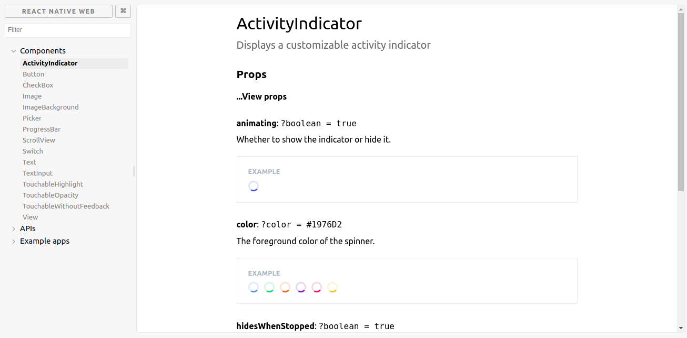
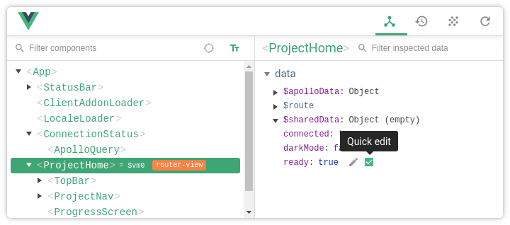

# vue 前端项目技术选型、开发工具、周边生态

> 声明：这不是一篇介绍 Vue 基础知识的文章，需要熟悉 Vue 相关知识

- 主架构：[vue](https://github.com/vuejs/vue), [vue-router](https://github.com/vuejs/vue-router), [vuex](https://github.com/vuejs/vuex)

- UI 框架：[element ui](https://github.com/ElemeFE/element), [iview](https://github.com/iview/iview), [vuetify](https://github.com/vuetifyjs/vuetify), [vux](https://github.com/airyland/vux), [mint-ui](https://github.com/ElemeFE/mint-ui), [vue-material](https://github.com/vuematerial/vue-material), [muse-ui](https://github.com/museui/muse-ui), [vant](https://github.com/youzan/vant), [bootstrap-vue](https://github.com/bootstrap-vue/bootstrap-vue)

- 服务器端渲染：[nuxt.js](https://github.com/nuxt/nuxt.js)

- 开发工具：[storybook](https://github.com/storybooks/storybook), [vue-devtools](https://github.com/vuejs/vue-devtools), [vue-loader](https://github.com/vuejs/vue-loader)

- 测试：[vue-test-utils](https://github.com/vuejs/vue-test-utils), [jest](https://github.com/facebook/jest)

- 插件库：[better-scroll](https://github.com/ustbhuangyi/better-scroll), [Vue.Draggable](https://github.com/SortableJS/Vue.Draggable), [vee-validate](https://github.com/baianat/vee-validate), [vue-awesome-swiper](https://github.com/surmon-china/vue-awesome-swiper), [vue-multiselect](https://github.com/shentao/vue-multiselect), [vue-i18n](https://github.com/kazupon/vue-i18n), [v-charts](https://github.com/ElemeFE/v-charts)

## 1. 架构选型演进

1. 如果页面比较简单，可以只用 `vue`
2. 如果需要本地路由功能，比如在单页面应用（SPA）中维持多个页面，并且可以本地控制路由跳转逻辑，这时就需要搭配使用 `vue-router`
3. 一般稍复杂的页面都会遇到一些问题：组件之间的通信问题（比如 A 组件想要改变 B 组件的数据）、跨组件数据储存与共享问题（比如多页面购物车数据存储）。`vue` 本身并不能很好的解决这个问题，需要搭配使用 `vuex`

## 2. 选择 UI 框架

使用一个现成的 UI 框架，可以少写很多代码。

目前比较推荐的是：

- [element ui](https://github.com/ElemeFE/element)：饿了么出品
- [iview](https://github.com/iview/iview)：一套很棒的 UI 框架
- [vuetify](https://github.com/vuetifyjs/vuetify)：google 材质设计的实现
- [vux](https://github.com/airyland/vux)：移动端 UI 框架
- [mint-ui](https://github.com/ElemeFE/mint-ui)：移动端 UI 框架
- [vue-material](https://github.com/vuematerial/vue-material)：另一个 google 材质设计的实现
- [muse-ui](https://github.com/museui/muse-ui)：移动端 UI 框架
- [vant](https://github.com/youzan/vant)：移动端 UI 框架

## 3. 服务器端渲染

服务器端渲染用得最多的是 [nuxt.js](https://github.com/nuxt/nuxt.js)。

`nuxt.js` 有目录结构、书写方式、组件集成、项目构建等的约束，整个应用中是没有 `html` 文件的，所有的响应 `html` 都是 node 动态渲染的，包括里面的元信息、`css, js` 路径等。渲染过程中，`nuxt.js` 会根据路由，将首页所有的组件渲染成 `html`，余下的页面保留原生组件的格式，在客户端渲染。

更多参考：[细说后端模板渲染、客户端渲染、node 中间层、服务器端渲染（ssr）](../extend/5.md)

## 4. 开发工具

开发时主要会用到的工具。

### 4.1 [storybook](https://github.com/storybooks/storybook)

`storybook` 为组件开发搭建了一个强大的开发环境，并提供了以下的几个功能：

- 提供了一个强大的 UI 组件管理页面，可以很便捷、清晰的分组、管理多个组件或一个组件的多个不同状态
- 在自动化交互测试之外，可以很方便的进行手动交互测试，并且可以动态改变组件参数，查看视图变化
- 可以将组件预览导出为静态资源，这样就可以很方便查看组件的文档和不同参数对应的不同视图
- 还有一系列的插件，提供了很多额外的功能，帮助你更好的开发、测试、优化组件

更多参考：[react、vue 组件开发利器：storybook](../advanced/16.md)

### 4.2 [vue-devtools](https://github.com/vuejs/vue-devtools)

这是专门针对 `vue` 组件开发的 chrome 开发者工具插件，就像开发者工具的 `Elements` 一样，可以查看整个页面的 `vue` 组件树和每个组件的 `data`，并且可以动态的更改 `data`，然后会更新 UI 到应用上。

#### 安装

通过 chrome 应用商店安装 [chrome - vuejs-devtools](https://chrome.google.com/webstore/detail/vuejs-devtools/nhdogjmejiglipccpnnnanhbledajbpd).

其他安装方式查看 [vue-devtools](https://github.com/vuejs/vue-devtools).

### 4.3 [vue-loader](https://github.com/vuejs/vue-loader)

加载 `.vue` 单文件组件的 [webpack](https://github.com/webpack/webpack) loader。

## 5. 测试

一般 `vue` 组件的测试，会用 [vue-test-utils](https://github.com/vuejs/vue-test-utils) + [jest](https://github.com/facebook/jest) / [mocha](https://github.com/mochajs/mocha) / [tape](https://github.com/substack/tape) / [ava](https://github.com/avajs/ava)。

## 6. 插件库

一些很实用的插件库：

- [better-scroll](https://github.com/ustbhuangyi/better-scroll)：[iscroll](https://github.com/cubiq/iscroll) 的封装
- [Vue.Draggable](https://github.com/SortableJS/Vue.Draggable)：[Sortable](https://github.com/SortableJS/Sortable) 的封装
- [vee-validate](https://github.com/baianat/vee-validate)：数据校验组件
- [vue-awesome-swiper](https://github.com/surmon-china/vue-awesome-swiper)：[swiper](https://github.com/nolimits4web/swiper) 的封装
- [vue-multiselect](https://github.com/shentao/vue-multiselect)：下拉选择组件
- [vue-i18n](https://github.com/kazupon/vue-i18n)：国际化组件
- [v-charts](https://github.com/ElemeFE/v-charts)：[echarts](https://github.com/apache/incubator-echarts) 的封装

## 后续

更多博客，查看 [https://github.com/senntyou/blogs](https://github.com/senntyou/blogs)

作者：[深予之 (@senntyou)](https://github.com/senntyou)

版权声明：自由转载-非商用-非衍生-保持署名（[创意共享 3.0 许可证](https://creativecommons.org/licenses/by-nc-nd/3.0/deed.zh)）
