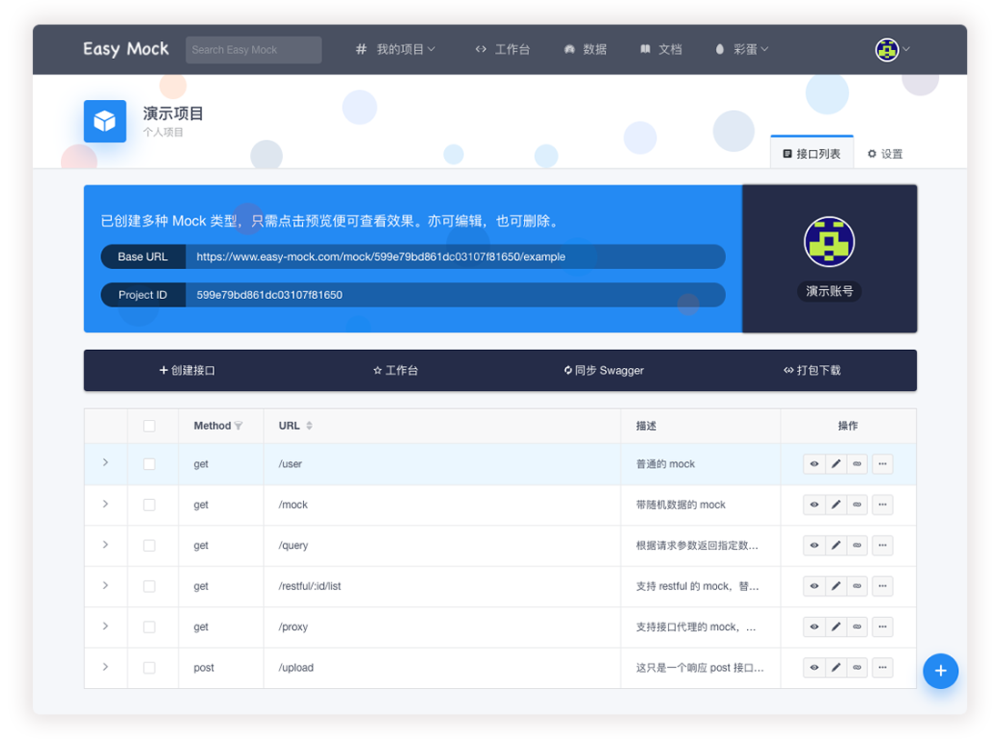

# api 接口管理工具

现在，Web 应用的前后端分离事实上已经成为了大家都认可的一种开发方式，前后端分离之后，前端与后端都用接口（api）来沟通，这就需要我们做好 API 接口管理，所以，这次来聊聊 API 接口管理工具。

API 接口管理工具大致分为线上工具和自建工具。

## 1. 线上工具

比较热门的线上工具有：

- [eolinker](https://www.eolinker.com)
- [apizza](https://apizza.net)：界面与 `postman` 比较像
- [easyapi](https://www.easyapi.com/)
- [apiview](https://apiview.com/)

## 2. 自建工具

企业一般都采用自建工具，自己维护一套 API 接口管理工具，比较热门的有：

- [yapi](https://github.com/YMFE/yapi)：去哪儿出品，线上演示地址 [http://yapi.demo.qunar.com](http://yapi.demo.qunar.com)
- [RAP](https://github.com/thx/RAP) / [rap2-delos](https://github.com/thx/rap2-delos) + [rap2-dolores](https://github.com/thx/rap2-dolores)：阿里出品，线上演示地址 [http://rap2.taobao.org/](http://rap2.taobao.org/)
- [easy-mock](https://github.com/easy-mock/easy-mock)：线上演示地址 [https://easy-mock.com/](https://easy-mock.com/)
- [swagger](https://swagger.io/)：国外比较热门的接口管理工具

### 2.1 yapi

> 环境需求：Node.js (>= v7.6) & MongoDB (>= v2.6) & Git

`yapi` UI 很漂亮，操作很流畅，安装比较简单，使用也比较简单，不与其他第三方工具或语言绑定。

如果喜欢简单、UI 友好的，推荐使用这个。

安装：[yapi#安装](https://github.com/YMFE/yapi#%E5%AE%89%E8%A3%85)

### 2.2 RAP / rap2-delos + rap2-dolores

> 环境需求：Node.js (>= v8.9) & MySQL (>= v5.7) & Redis（>= v4.0）

`rap` 功能非常全，UI 不是很漂亮，安装比较复杂，使用也比较复杂，数据生成使用 [mock.js](https://github.com/nuysoft/Mock)。

如果对功能完善、系统稳定、用 `mock.js` 生成数据有偏好的，推荐使用这个。

RAP 目前有两个版本，第一个版本的 [RAP](https://github.com/thx/RAP) 已经被官方废弃了，建议用第二个版本。

RAP2 分成了两个包：

- [rap2-delos](https://github.com/thx/rap2-delos)：后端数据 API 服务器
- [rap2-dolores](https://github.com/thx/rap2-dolores)：前端静态资源

RAP2 的安装步骤要麻烦一些，`rap2-delos` 可以参考官方文档 [rap2-delos#部署](https://github.com/thx/rap2-delos#%E9%83%A8%E7%BD%B2)、[非官方 rap2-delos 部署文档](https://github.com/thx/rap2-delos/issues/119)，`rap2-dolores` 可以参考官方文档 [rap2-dolores#deployment-部署](https://github.com/thx/rap2-dolores#deployment-%E9%83%A8%E7%BD%B2)。

### 2.3 easy-mock

> 环境需求：Node.js (>= v8.9) & MongoDB (>= v3.4) & Redis（>= v4.0）

`easy-mock` UI 很漂亮，操作很流畅，安装比较简单，使用也比较简单，数据生成使用 [mock.js](https://github.com/nuysoft/Mock)，并且支持导入 Swagger Docs API。

如果喜欢简单、UI 友好的，并且喜欢用 `mock.js` 生成数据或者导入 Swagger Docs API 的，推荐使用这个。

安装：[easy-mock#quick-start](https://github.com/easy-mock/easy-mock#quick-start)

### 2.4 swagger

Swagger 其实并不是一个工具，而是一系列工具，或者说叫一个生态：

- [OpenAPI-Specification](https://github.com/OAI/OpenAPI-Specification)：基于 `yaml` 语法格式定义的一套开放 API 文档规范
- [swagger-ui](https://github.com/swagger-api/swagger-ui)：UI 展示库
- [swagger-codegen](https://github.com/swagger-api/swagger-codegen)：根据 Swagger 定义的 RESTful API 自动生成 Swagger 文档（for java）
- [swagger-core](https://github.com/swagger-api/swagger-core)：java 核心库
- [swagger-editor](https://github.com/swagger-api/swagger-editor)：可视化编辑器
- [ReDoc](https://github.com/Rebilly/ReDoc)：生成格式优美的 UI 界面（第三方）
- [swagger-node](https://github.com/swagger-api/swagger-node)：for node.js
- [go-swagger](https://github.com/go-swagger/go-swagger)：for Go

如你所见，这个生态功能非常全，但使用非常复杂，入门坎比较高。

这套工具对后端非常有用，特别是 java 开发，能直接根据注释自动生成相应的 API 规范文档，然后直接根据这个 API 规范文档自动生成 UI 可视化界面与数据 Mock 服务器，而不是我们手动创建。

安装：[swagger](https://swagger.io/)

## 3. 其他工具

上面讲的，不管是线上工具还是自建工具，都是接口集成工具，主要是为了提供数据 Mock 功能。

如果仅仅是为了以静态文本的形式做展示用，可以试试下面的一些工具：

### 3.1 Git 仓库 + Markdown

把接口文档单独建一个项目，使用 Markdown 的格式来书写。

[了解 Markdown 语法](https://daringfireball.net/projects/markdown/)。

### 3.2 leanote

类似网易云笔记、印象笔记的笔记管理工具。

[了解 leanote](https://github.com/leanote/leanote)。

### 3.3 gollum

基于 Git 的 wiki 系统。

[了解 gollum](https://github.com/gollum/gollum)。

### 3.4 wiki.js

基于 Node.js 的 wiki 系统。

[了解 wiki.js](https://github.com/Requarks/wiki)。

## 后续

更多博客，查看 [https://github.com/senntyou/blogs](https://github.com/senntyou/blogs)

作者：[深予之 (@senntyou)](https://github.com/senntyou)

版权声明：自由转载-非商用-非衍生-保持署名（[创意共享 3.0 许可证](https://creativecommons.org/licenses/by-nc-nd/3.0/deed.zh)）
